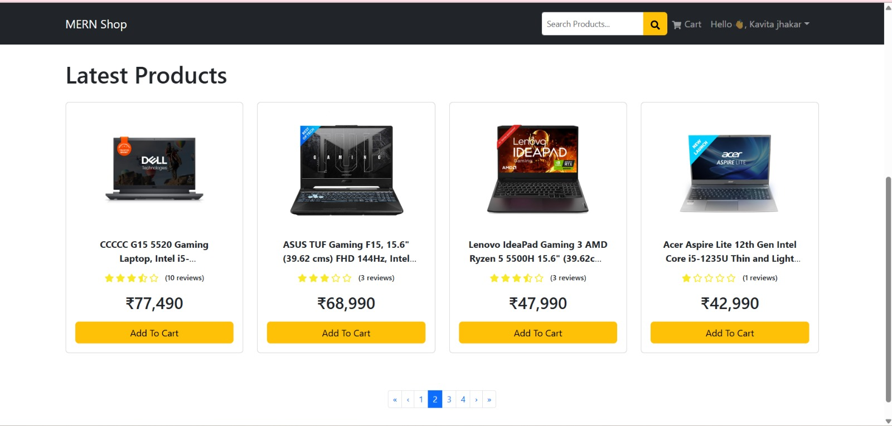

# eCommerce Platform Project - MERN Stack

Welcome to the eCommerce Platform Project built using the MERN (MongoDB, Express.js, React, Node.js) Stack. This project provides a robust and full-featured online shopping platform with various functionalities to enhance the user experience.





## Features

- **Full-Featured Shopping Cart**: Seamless shopping cart functionality for users to add, remove, and manage products.
- **Product Reviews and Ratings**: Users can leave reviews and provide ratings for products.
- **Top Products Carousel**: Display a carousel of top-rated or featured products.
- **Product Pagination**: Navigate through products efficiently with pagination.
- **Product Search Feature**: Easily search for products based on keywords.
- **User Profile with Orders**: Users can create profiles and track their order history.
- **Admin Dashboard**: Comprehensive dashboard for administrators to manage admins, products, users, and orders.
- **Admin Admin Management**: Manage admin accounts.
- **Admin Product Management**: Add, edit, and delete products from the platform.
- **Admin User Management**: Manage user accounts.
- **Admin Order Details Page**: Access detailed information about each order.
- **Mark Orders as Delivered Option**: Ability to update order status to "delivered."
- **Checkout Process**: Seamless checkout with options for shipping and payment methods.
- **Razorpay Integration**: Secure payment processing through Razorpay.
- **Database Seeder**: Easily populate the database with sample products and users.

## Getting Started

### Prerequisites

1. Fork the repository to your GitHub account.
2. Clone the forked repository to your local machine

```bash
git clone https://github.com/jakharkavita/MERN-eCommerce.git
```

```bash
cd MERN-eCommerce
```

3. Create a MongoDB database and obtain your MongoDB URI from [MongoDB Atlas](https://www.mongodb.com/cloud/atlas).
4. Create a Razorpay account and obtain your Key ID and Key Secret from [Razorpay](https://razorpay.com/).
5. Create a Brevo account and generate a new SMTP Key from [Brevo](https://www.brevo.com/)

### Env Variables

1. Rename the `.env.example` file to `.env` and add the following environment variables:

```dotenv
NODE_ENV=development
PORT=5000
JWT_SECRET=ADD_YOUR_JWT_SECRET_HERE
MONGO_URI=ADD_YOUR_MONGO_URI_HERE
RAZORPAY_KEY_ID=ADD_YOUT_RAZORPAY_KEY_ID
RAZORPAY_KEY_SECRET=ADD_YOUR_RAZORPAY_KEY_SECRET
PAGINATION_MAX_LIMIT=12 # This will show 12 products per page; you can change it.
EMAIL_HOST=smtp-relay.brevo.com
EMAIL_PORT=587
EMAIL_USER=ADD_YOUR_BREVO_LOGIN
EMAIL_PASS=ADD_YOUR_BREVO_PASSWORD
EMAIL_FROM=ADD_YOUR_BREVO_LOGIN
```

### Install Dependencies

Run the following commands to install dependencies for both the frontend and backend:

```bash
npm install
cd frontend
npm install
```

### Run

To run both the frontend and backend concurrently, use:

```bash
npm run dev
```

To run only the backend:

```bash
npm run server
```

## Seed Database

Use the following commands to seed the database with sample users and products, or destroy all data:

```bash
# Import data
npm run data:import

# Destroy data
npm run data:destroy
```

## Making Changes

1. Implement your changes and improvements.

2. Ensure that your changes adhere to the project's coding style and conventions.

3. Test your changes thoroughly to avoid introducing bugs.

4. Update the project documentation if necessary.

## Committing Changes

1. Commit your changes with a descriptive commit message:

   ```bash
   git add .
   git commit -m "Add your descriptive commit message here"
   ```

2. Push your changes to your forked repository:

   ```bash
   git push origin feature/your-feature-name
   git push origin issues/your-issue-name
   ```

## Creating a Pull Request (PR)

1. Visit your forked repository on GitHub.

2. Switch to the branch containing your changes.

3. Click on the "New Pull Request" button.

4. Provide a clear title and description for your pull request, explaining the purpose and scope of your changes.

5. Submit the pull request.

## Code Review

Your contribution will be reviewed by the project maintainers. Be prepared to address any feedback or suggestions to ensure the quality and compatibility of your changes.

## Thank You!

Thank you for considering contributing to the eCommerce Platform Project. Your efforts help make this project better for everyone. If you have any questions or need assistance, feel free to reach out through the issue tracker or discussions. Happy coding🤩!
